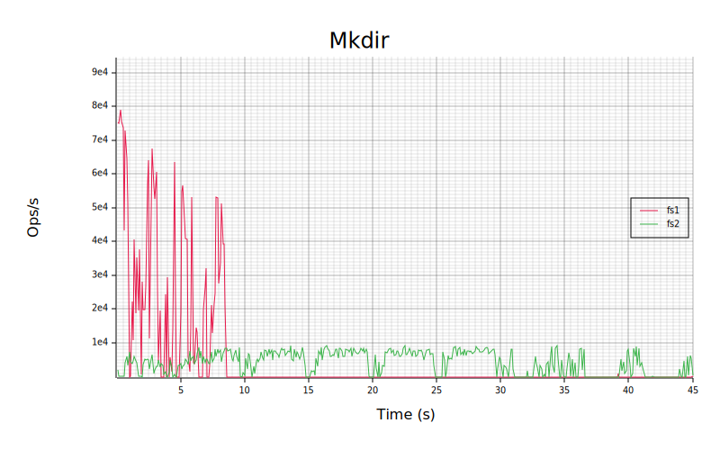
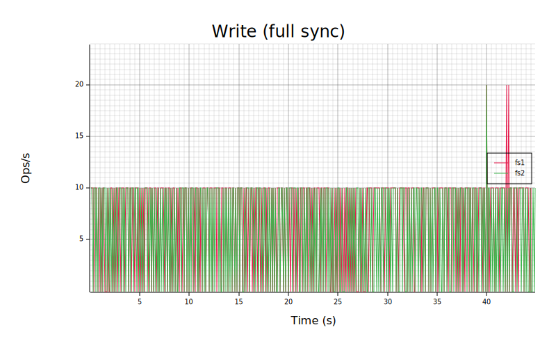

# FS-Bench: filesystem benchmarking framework

FS-Bench is an open-source benchmarking and plotting framework that is
configurable and easy to use for evaluating the filesystems performance by executing the pre-defined micro-benchmarks that
capture the effect of caching and buffering whenever applicable, or
replaying system call level trace logs.

FS-Bench generates precise statistics compared to other
benchmarks and visualize the filesystem performance into descriptive plots. Also, FS-Bench provides real-time
benchmarks to reveal the system behaviour over time. Such real-time
plots provide useful information about the system sync periods,
performance degradation, and the operations execution times.

FS-Bench also supports benchmarking multiple systems in a single run and
it generates combined plots for better comparison, which is the ideal
case for a user rather than separate runs, separate results and the
usage of another plotting tool to compare the results.

## Examples
Below are some benchmark results plotted by FS-Bench:

#### Static plots

#### Real-time plot (about 30 seconds)

## Configuration
FS-Bench can be configured with just a few command-line arguments. The list of input arguments are:
<pre>
-b, --bench-mode <BENCH_MODE>&nbsp;&nbsp;&nbsp;&nbsp;&nbsp;&nbsp;&nbsp;&nbsp;&nbsp;&nbsp;&nbsp;The bench mode: static, realtime, trace, throughput
-f, --bench-fn <BENCH_FN>&nbsp;&nbsp;&nbsp;&nbsp;&nbsp;&nbsp;&nbsp;&nbsp;&nbsp;&nbsp;&nbsp;&nbsp;&nbsp;The benchmark function to be run in real-time
-h, --help&nbsp;&nbsp;&nbsp;&nbsp;&nbsp;&nbsp;&nbsp;&nbsp;&nbsp;&nbsp;&nbsp;&nbsp;&nbsp;&nbsp;&nbsp;&nbsp;&nbsp;&nbsp;Print help information
-i, --io-size <IO_SIZE>&nbsp;&nbsp;&nbsp;&nbsp;&nbsp;&nbsp;&nbsp;&nbsp;&nbsp;&nbsp;&nbsp;&nbsp;&nbsp;&nbsp;The I/O size, default: 4 KiB
-j, --parallelism-degree <PARALLELISM_DEGREE>&nbsp;&nbsp;&nbsp;The parallelism degree to replay a trace, default: 4
-l, --file-size <FILE_SIZE>&nbsp;&nbsp;&nbsp;&nbsp;&nbsp;&nbsp;&nbsp;&nbsp;&nbsp;&nbsp;&nbsp;&nbsp;The fileset's file sizes, default: 10 MiB
-m, --mount <MOUNT>&nbsp;&nbsp;&nbsp;&nbsp;&nbsp;&nbsp;&nbsp;&nbsp;&nbsp;&nbsp;&nbsp;&nbsp;&nbsp;&nbsp;&nbsp;&nbsp;The path to the mounted filesystem being benchmarked
-n, --fs-name <FS_NAME>&nbsp;&nbsp;&nbsp;&nbsp;&nbsp;&nbsp;&nbsp;&nbsp;&nbsp;&nbsp;&nbsp;&nbsp;&nbsp;&nbsp;Filesystem name that is being benchmarked
-p, --log-path <LOG_PATH>&nbsp;&nbsp;&nbsp;&nbsp;&nbsp;&nbsp;&nbsp;&nbsp;&nbsp;&nbsp;&nbsp;&nbsp;&nbsp;The path to store benchmark results
-s, --fileset-size <FILESET_SIZE>&nbsp;&nbsp;&nbsp;&nbsp;&nbsp;&nbsp;&nbsp;&nbsp;&nbsp;Maximum number of files in a fileset, default: 1000
-t, --time <TIME>&nbsp;&nbsp;&nbsp;&nbsp;&nbsp;&nbsp;&nbsp;&nbsp;&nbsp;&nbsp;&nbsp;&nbsp;&nbsp;&nbsp;&nbsp;&nbsp;&nbsp;The running time, default: 60 s
-w, --workload  <WORKLOAD>&nbsp;&nbsp;&nbsp;&nbsp;&nbsp;&nbsp;&nbsp;&nbsp;&nbsp;&nbsp;&nbsp;&nbsp;The path to the trace log file
</pre>

## Supported benchmark modes
FS-Bench supports static, realtime, throughput and trace replay modes:
- static: this mode evaluates the cost of creating files and directories and reading and writing from/into files. The
  basic operations that can be benchmarked in static mode are _mkdir_, _mknod_, _read_, _write_, _cold-read_ and
  _write-full-sync_. Each benchmark function is run for 60 seconds in this mode with 4 KiB as io size as default. The
  runtime and io size can be configured with `-t` and `-i` input arguments, respectively.
- realtime: this mode benchmark the same operations as the static mode with similar default arguments; however, this mode
  shows the benchmark results in realtime on live plots. The plot is updated every 200 milliseconds. In this mode, the
  benchmark function should be specified by `-f` input argument. The valid benchmark functions are: `mkdir`, `mknod`,
  `read`, `cold_read`, `write`, `write_sync`.
- throughput: the read and write throughput of the system is benchmarked. In this mode, a fileset is created, including
  10,000 files, each of size 4 KiB as default. The fileset size and the file sizes can be configured with `-s` and `-l`
  input arguments, respectively.
- trace: in this mode, a trace log of a system call level of a real-world workload is replayed. The trace log is
  parsed by a [strace-parser](https://gitlab.com/arastoob/strace-parser), then the parsed trace is replayed. In this mode,
  the parallelism degree can be specified with `-j` input argument (default to 4), which is the number of threads in a
  thread pool that replay the processes in parallel.

## Run
To run FS-Bench, execute the following command:
 
<pre>
git clone https://gitlab.com/arastoob/fs-bench.git
cd fs-bench/
cargo run --release -- -n {the-system-name} -m {mount-path} -o {path-to-output-file} -p {log-result-path} -b {bench-mode} [options]
</pre>

As mentioned earlier, FS-Bench can benchmark more than one file system in a run. For example, for benchmarking three 
file systems with names fs1, fs2, fs3:
 
<pre>
cargo run --release -- -n fs1 -m {mount-path-of-fs1} -n fs2 -m {mount-path-of-fs2} -n fs3 -m {mount-path-of-fs3} -o {path-to-output-file} -p {log-result-path} -b {bench-mode} [options]
</pre>

## Outputs
In addition to the plots shown as [examples](#example) before, FS-Bench generates `.csv` files, including the detailed
statistics about the benchmark results, that are logged in the path specified by the `-p` input argument. Also, in the
trace replay mode, FS-Bench outputs statistics about the operation times per each process to `.txt` files. An example is
shown below, that is a portion of such a file:
<pre>
919117
    114 Read         212.587 us   (0.1516 %  of total time)
     40 Write        118.548 us   (0.0846 %  of total time)
     18 OpenAt       76.359 us    (0.0545 %  of total time)
      2 Mknod        30.771 us    (0.0219 %  of total time)
      1 Rename       26.072 us    (0.0186 %  of total time)
     13 Fstat        18.31999 us  (0.0131 %  of total time)
     10 Stat         15.145 us    (0.0108 %  of total time)
      1 Truncate     5.849 us     (0.0042 %  of total time)
919118
    114 Read         213.05 us    (0.1520 %  of total time)
     40 Write        126.98 us    (0.0906 %  of total time)
     18 OpenAt       74.823 us    (0.0534 %  of total time)
     13 Fstat        30.636 us    (0.0219 %  of total time)
      2 Mknod        25.436 us    (0.0181 %  of total time)
      1 Rename       16.927 us    (0.0121 %  of total time)
     10 Stat         14.951 us    (0.0107 %  of total time)
      1 Truncate     6.79 us      (0.0048 %  of total time)
919119
    115 Read         195.492 us   (0.1394 %  of total time)
     40 Write        117.281 us   (0.0837 %  of total time)
     18 OpenAt       68.022 us    (0.0485 %  of total time)
      2 Mknod        23.29 us     (0.0166 %  of total time)
     13 Fstat        17.281 us    (0.0123 %  of total time)
      1 Rename       15.56999 us  (0.0111 %  of total time)
     10 Stat         13.816 us    (0.0099 %  of total time)
      1 Truncate     6.107 us     (0.0044 %  of total time)
919120
    116 Read         196.736 us   (0.1403 %  of total time)
     42 Write        127.679 us   (0.0911 %  of total time)
     18 OpenAt       67.07299 us  (0.0478 %  of total time)
      2 Mknod        22.904 us    (0.0163 %  of total time)
     13 Fstat        17.235 us    (0.0123 %  of total time)
      1 Rename       15.26899 us  (0.0109 %  of total time)
     10 Stat         13.675 us    (0.0098 %  of total time)
      1 Truncate     5.852 us     (0.0042 %  of total time)
919121
    114 Read         208.21399 us (0.1485 %  of total time)
     39 Write        141.15799 us (0.1007 %  of total time)
     18 OpenAt       74.878 us    (0.0534 %  of total time)
      2 Mknod        24.488 us    (0.0175 %  of total time)
     13 Fstat        19.09799 us  (0.0136 %  of total time)
      1 Rename       18.831 us    (0.0134 %  of total time)
     10 Stat         14.803 us    (0.0106 %  of total time)
      1 Truncate     6.509 us     (0.0046 %  of total time)
919122
    120 Read         453.44599 us (0.3234 %  of total time)
     41 Write        147.207 us   (0.1050 %  of total time)
     18 OpenAt       74.736 us    (0.0533 %  of total time)
      2 Mknod        27.293 us    (0.0195 %  of total time)
     13 Fstat        19.374 us    (0.0138 %  of total time)
      1 Rename       16.702 us    (0.0119 %  of total time)
     10 Stat         14.951 us    (0.0107 %  of total time)
      1 Truncate     6.518 us     (0.0046 %  of total time)
919123
    114 Read         183.84999 us (0.1311 %  of total time)
     40 Write        124.607 us   (0.0889 %  of total time)
     18 OpenAt       75.784 us    (0.0541 %  of total time)
      2 Mknod        22.976 us    (0.0164 %  of total time)
     13 Fstat        17.657 us    (0.0126 %  of total time)
      1 Rename       14.277 us    (0.0102 %  of total time)
     10 Stat         13.879 us    (0.0099 %  of total time)
      1 Truncate     5.882 us     (0.0042 %  of total time)
919124
    118 Read         193.74599 us (0.1382 %  of total time)
     40 Write        120.203 us   (0.0857 %  of total time)
     18 OpenAt       76.342 us    (0.0545 %  of total time)
      2 Mknod        22.477 us    (0.0160 %  of total time)
     13 Fstat        17.42599 us  (0.0124 %  of total time)
      1 Rename       13.894 us    (0.0099 %  of total time)
     10 Stat         13.537 us    (0.0097 %  of total time)
      1 Truncate     5.795 us     (0.0041 %  of total time)
</pre>
